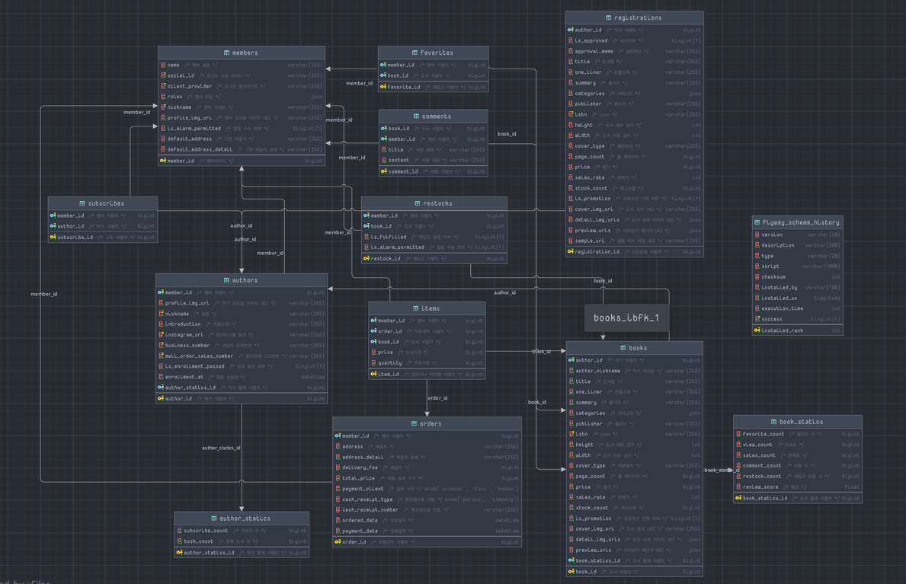
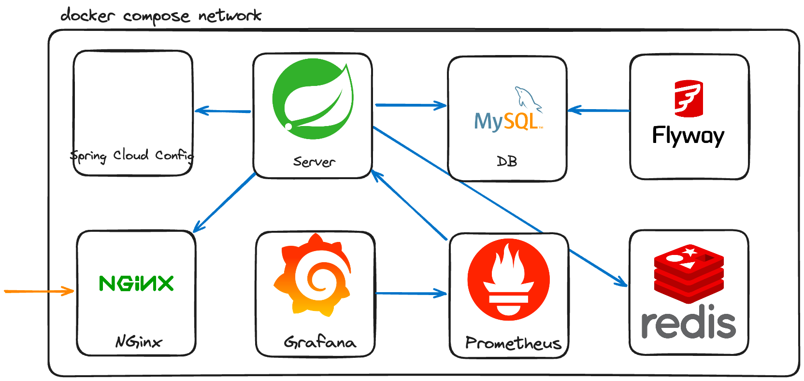
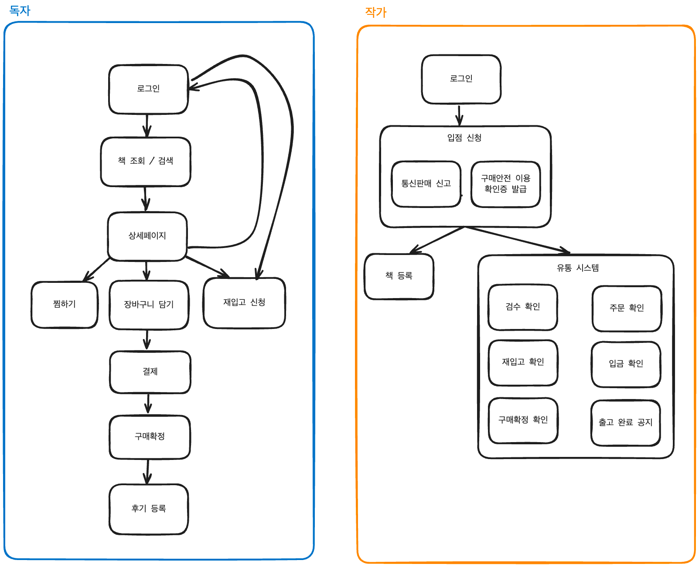

# 고구마서점 백엔드 서버

## 🪄 기술 스택
- `Spring Boot`, `Spring Security`, `Spring Cloud Config`, `MySQL`, `JPA`
- `Docker`, `AWS`, `Prometheus`, `Loki`, `Grafana`, `Jacoco`, `SonarQube`, `Github Action`
- `공공데이터포털`, `Figma`, `Notion`

## 📋 ERD

## 서버 아키텍처

## 서비스 흐름도

## ✅ 작업 내용
[고구마서점 프로젝트 대시보드](https://github.com/users/onetuks/projects/2)
